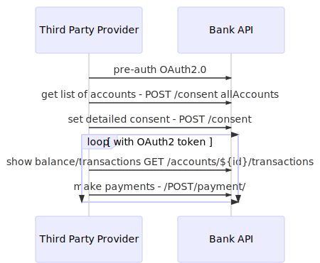

title: Openbanking APIs
author:
  name: Antanas Sinica, Mindaugas Žilinskas
  url: https://www.swedbank.com/openbanking/
output: index.html
controls: true
style: style.css

--

# Banks' Open API - behind the scenes
## Antanas Sinica, Mindaugas Žilinskas

--

### Today

* PSD2 - what is it?
* Swedbank API
* Consuming the APIs
* Your turn ʕ·͡ᴥ·ʔ

--

# PSD2 - what is it?

--
### Before PSD2
<span>

</span>

--
### After PSD2

<span>

</span>

--
### PSD2 in human terms
#### Main message - Customer is owner of account, so Customer can use any intermediate as a channel or product provider to use his own accounts
#### PSD2 services are provided on same cost basis as main channel (bank is not charging extra from TPP)
#### TPP has no agreement with bank

--
### PSD2 in technical terms
##### Customer auth methods - <b>redirect</b>, later decoupled / embedded
##### Pre-authenticate step (OAuth2 with grant code flow)
##### API based on Berlin Group Specification
* /consents/
* /accounts/${id}/balance, /accounts/${id}/transactions
* /payments/sepa-credit-transfer

--

### General schema

<span>

</span>

--

# Swedbank API
## Mutual TLS (QWAC), OAuth2, Signing (QSEALC), Redirect flow

--

### Security architecture
#### Can anyone call bank API to get any body's any account data or execute any payment?

* Not anyone - use mutual TLS based on QWAC as proof of certified TPP
* Not anybody - use SCA based OAuth2 as auth engine for proving Customer identity
* Not any account - customer must give consent (use SCA to sign it).
* Not any payment - customer must sign payment (use SCA to sign it).

--

### Security architecture
#### Can certified TPP call bank API to get your allowed accounts data & initiate payment?

* Yes :)

#### Can TPP misbehave? Or be hacked?

* QSealC for payments signing
* OAuth2 token mapping to TLS
* Short token lifetime
* Anti-fraud systems
* ...

--

### Security architecture
<span>

</span>

--
### Oauth2 schema
10. TPP: check status:  /accounts/${id}/balances  + /accounts/${id}/transactions
<<diagram>>

--
### Payments schema
10. TPP: check status:  /accounts/${id}/balances  + /accounts/${id}/transactions
<<diagram>>

--

# Consuming the APIs

--

### API Aggregation problem

* 6000+ financial institutions in EU
* PSD2 and RTS written in English
* Fragmented standards:
  * Berlin group standard written in mostly English (DE, NL, SE, FI, NO, DK, LT, LV, EE, ES, ...)
  * UK Open Banking standards (UK)
  * STET (FR)
  * PolishAPI (PL)
  * Slovak Banking API Standard (SK)
  * ...

--

### Initiate payment in Swedbank Baltics

Complexity level: 1

`POST https://psd2.api.swedbank.com/sandbox/v1/payments/pain.001-sepa-credit-transfers` <sup>

```
<?xml version="1.0" encoding="UTF-8"?>
<Document xmlns="urn:iso:std:iso:20022:tech:xsd:pain.001.001.03" xmlns:xsi="http://www.w3.org/2001/XMLSchema-instance" xsi:schemaLocation="urn:iso:std:iso:20022:tech:xsd:pain.001.001.03 pain.001.001.03.xsd">
  <CstmrCdtTrfInitn>
    <GrpHdr>
      <MsgId>Message-ID-4711</MsgId>
      <CreDtTm>2010-11-11T09:30:47.000Z</CreDtTm>
      <NbOfTxs>2</NbOfTxs>
      <InitgPty>
        <Nm>Initiator Name</Nm>
      </InitgPty>
    </GrpHdr>
    <PmtInf>
      <PmtInfId>Payment-Information-ID-4711</PmtInfId>
      <PmtMtd>TRF</PmtMtd>
      <BtchBookg>true</BtchBookg>
      <NbOfTxs>2</NbOfTxs>
      <CtrlSum>6655.86</CtrlSum>
      <PmtTpInf>
        <SvcLvl>
          <Cd>SEPA</Cd>
        </SvcLvl>
      </PmtTpInf>
      <ReqdExctnDt>2010-11-25</ReqdExctnDt>
      <Dbtr>
        <Nm>Debtor Name</Nm>
      </Dbtr>
      <DbtrAcct>
        <Id>
          <IBAN>DE87200500001234567890</IBAN>
        </Id>
      </DbtrAcct>
```

--

### Initiate payment in Swedbank Sweden

Complexity level: 1 * 2 = 2

`POST https://psd2.api.swedbank.com/sandbox/v1/payments/se-domestic-ct`

```

{
"instructed_amount" : {"currency" : "SEK" , "content" : 123},
"debtor_account" : { "bban":"1234-5,987 654 321-9"},
"creditor_account": {"bban":"BG 2345-6789"},
"remittance_information_unstructured" : "OCR Number 1234567890"
}
```

--

### Initiate payment in SEB Baltics

Complexity level: 2 * 2 = 4

`POST https://api.ob.baltics.sebgroup.com/v1/payments/sepa-credit-transfers`

```
{
	"endToEndId": "xxxxxxxxxxxxMxxxNxxxxxxxxxxxxxxx",
	"debtorAccount": "",
	"amount": 11,
	"currency": "EUR",
	"creditorAccount": "EE581010010607110014",
	"remittanceInformationUnstructured": "test payment",
	"creditor": "Test  user",
	"debtor": "Debtor 1"
}
```

And it has 4 possible statuses: ACTC, PDNG, ACSC, RJCT

--

### Initiate payment in SEB Sweden

Complexity level: 4 * 2 = 8

`POST https://api.seb.se/open/sb/v1/pis/payments` <br />
`PUT https://api.seb.se/open/sb/v1/pis/payments/{paymentId}`

```
{
  "paymentId": "STOHYD01180208082256128737000001",
  "transactionStatus": "ACCP",
  "templateId": "PRIVATE_BANKGIRO",
  "remittanceInformationStructured": {
    "reference": "234634699",
    "referenceType": "OCR"
  },
  "remittanceInformationUnstructured": "Liten drake",
  "debtorAccountMessage": "Text for my payment",
  "creditorAccountMessage": "Text to you",
  "requestedExecutionDate": "2018-02-12",
  "instructedAmount": {
    "currency": "SEK",
    "amount": 345.5
  },
  "debtorAccount": {
    "iban": "SE8050000000052800025220"
  },
  "creditorAccount": {
    "iban": "SE8050000000052800025220",
    "pgnr": "44580264",
    "bgnr": "0001212121"
  },
  "chosenScaMethod": "Mobilt BankID",
  "_links": {
    "status": {
      "href": "/payments/STOHYD01180208082256128737000001/status"
    }
  }
}
```

--

### Status field behavior

Complexity level: 8 * 2 = 16

* Defined in PSD2: ACCP, ACSC, ACSP, ACTC, ACWC, ACWP, PART, RCVD, PDNG, RJCT
* Used in Swedbank RJCT, ACSC, ACSP, PART, ACTC
* Used in SEB Sweden RCVD, ACTC, ACCP, RJCT
* Used in SEB Baltics ACTC, PDNG, ACSC, RJCT

--

### HTTP Headers

Complexity level: 16 * 2 = 32

What HTTP headers you can find in the wild:
* psu-http-method
* Request-initiator
* TPP-Request-ID
* X-IBM-Client-Id, X-IBM-Client-Secret
* X-Application-Context

--

### HTTP Status codes

Complexity level: 32 * 2 = 64

Invalid from account specified when initiating a payment can give you

* 400 Bad Request
* 404 Not Found

--

### API Versioning

Complexity level: 64 * 2 = 128

* Some APIs are already v2
* Some version /payments seperately from /accounts

--

### Different API endpoints

Complexity level: 128 * 2 = 256

All of these different endpoints have their differences:

* /accounts, /accounts/${id}, /accounts/${id}/balance, /accounts/${id}/transactions
* /payments/sepa-credit-transfer

--

### Well how about other banks?

* 2 covered
* ~10 major in Baltics + Sweden
* ~30 major+minor in Baltics + Sweden

Complexity level: 256 * 8 = 2048

--

### Plz aggregate all Europe

Complexity level: over 9000

--

# Your turn ʕ·͡ᴥ·ʔ

-- final

### Upcomming

1. FinTechs will be/are all over this
2. 2019 September
3. Fun challenges on both sides of the fence


--

# Thx
## Q/A
